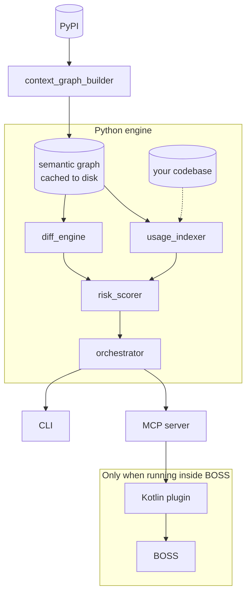

# PyUpgrade Intelligence

**Know exactly what will break before you upgrade a Python framework but not from a changelog, from the actual code.**

A semantic graph-based upgrade risk checker for Python frameworks like Django, Flask, etc.

> **BOSS Contributor Hackathon Submission** present in [`BOSS_SUBMISSION.md`](BOSS_SUBMISSION.md)

---
## The problem
"Is it safe to upgrade Django from 4.2 to 5.0?" is a question every Python developer eventually asks, and today the honest answer requires manually reading changelogs, guessing which of hundreds of changes actually touch your codebase, and hoping you didn't miss something. Every existing tool in this space answers the question by reading what maintainers *wrote* about a release. None of them read the actual code.

## What this does differently
PyUpgrade Intelligence builds a real semantic graph of a framework's source code - every function, class, and method, with real signatures, and how they call each other - for two versions, and structurally diffs them. It then cross-references that diff against your own codebase's actual usage, and produces a risk score with the exact files and lines that will break, and why.
- **Structural, not textual.** Catches undocumented breaking changes - a parameter renamed, a method quietly turned into a `@property`, a sync method becoming async, that never made it into a changelog.
- **Deterministic and explainable.** Every risk score traces back to a formula with a mathematical proof, not an LLM's best guess. See `docs/components/risk-scorer.md` and `Risk-Scoring-Mathematical-Model.md`.
- **Scoped to your code.** Out of hundreds of real changes in a framework release, you see only the ones that intersect with what you actually use.

## How it's delivered
- **A BOSS plugin**: seven MCP tools an attached agent can call directly. See [`docs/components/mcp-server.md`](docs/components/mcp_server.md) and [`docs/components/kotlin-plugin.md`](docs/components/kotlin_plugin.md).
- **A standalone CLI**: See [`docs/components/cli.md`](docs/components/cli.md).
- **A standalone MCP server**: usable with any MCP client (Claude Desktop, the MCP Inspector, etc.)

## Usage
### Standalone 
The engine works entirely on its own.

Some example commands look like:
```bash
python engine/cli.py check django 4.2 5.0 --repo path/to/your/project
python engine/cli.py changes django 4.2 5.0
python engine/cli.py usage django 4.2 --repo path/to/your/project
python engine/cli.py warm django 5.0
```

Full command reference: [`CLI-Specification.md`](CLI-Specification.md)

It also runs as a plain MCP Server, connectable from any MCP Client (like, Claude Desktop, MCP Inspector, and even your own MCP Client)
```bash
python engine/mcp_server.py
```

To run a server with a debugging inspector, run:
```bash
pip install mcp[cli]
mcp dev engine/mcp_server.py
```

### Inside BOSS Environment
See [`BOSS_SUBMISSION.md`](BOSS_SUBMISSION.md), an AI Agent gets the following tools automatically:

| Tool | What it does                                                 |
|---|--------------------------------------------------------------|
| `pyupgrade_check` | Risk score, recommendation, affected files                   |
| `pyupgrade_warm_cache` | Pre-builds a framework version's graph ahead of a real check |
| `pyupgrade_get_breaking_changes` | Structural diff, no user repo needed                         |
| `pyupgrade_get_usage` | What your codebase uses, independent of any diff             |
| `pyupgrade_get_affected_files` | Just the flagged file/line hits in your repo                 |
| `pyupgrade_get_config_diff` | Dependency/config file changes                               |
| `pyupgrade_list_cached_frameworks` | What's already cached locally                                |

An example prompt looks like: "is it safe to upgrade Django from 4.2 to 5.0 for this project?" and the AI Agent will pick the right tools on its own.

---
## Architecture



- `context_graph_builder` parses a framework's real source into a graph - every function, class, and method, with signatures, async/property flags, and a structural fingerprint of each body - plus the calls, imports, and inheritance between them.
- `diff_engine` and `usage_indexer` both read from that graph independently: one compares two versions structurally, the other scans the user's code for real usage, entirely on their machine.
- `risk_scorer` joins the two, only symbols that are both changed and used matter, and scores them with a risk scoring model.
- `orchestrator` wires all of this into a handful of functions that the CLI and MCP server both call directly.

---
## Documentation
- **New here?** Start with [`docs/USER_GUIDE.md`](docs/USER_GUIDE.md).
- **Want to understand a specific component?** See [`docs/components/`](docs/components/), which consists of one doc per component, covering what it is, and how it works.
- **About the design decisions, deferred features, and known limitations** See [`PyUpgrade-Intelligence-Design.md`](PyUpgrade-Intelligence-Design.md).
- **Want the exact CLI command reference?** See [`CLI-Specification.md`](CLI-Specification.md).
- **For risk scoring model** See [`Risk-Scoring-Mathematical-Model.md`](Risk-Scoring-Mathematical-Model.md).

## Data privacy
None of your source code is ever sent anywhere. Usage analysis happens entirely on your own machine. The only network calls this tool makes are to PyPI, to fetch *public* framework source code and package metadata, nothing about your project, its files, or its contents is ever transmitted.

## License
MIT (see [`LICENSE`](LICENSE))

## Author
Disha Singh ([@dishasingh-21](https://github.com/dishasingh-21))

Originally built for the BOSS Contributor Hackathon. Can also be used as a standalone CLI or MCP Server.